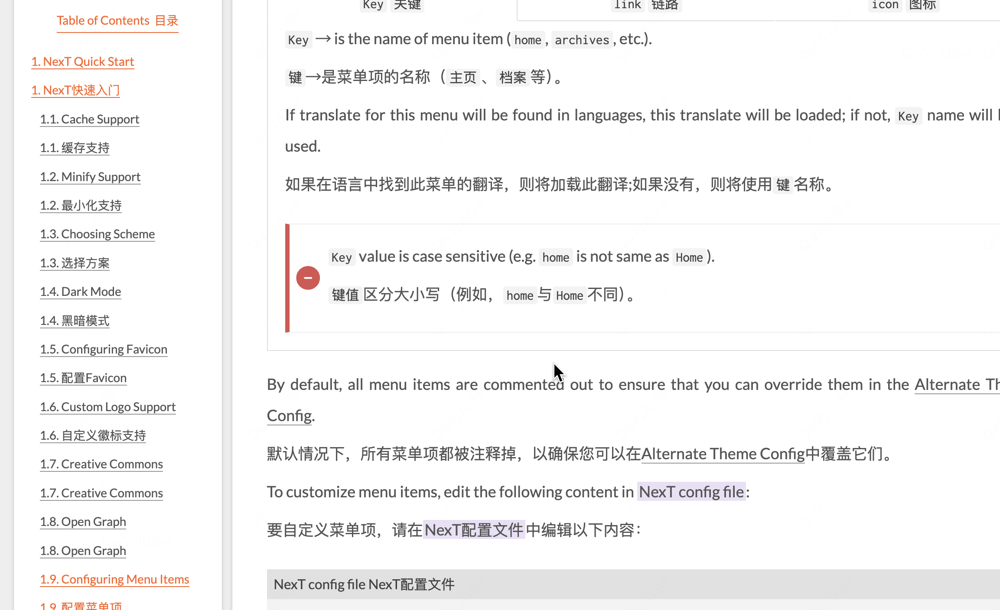

---
title: JavaScript 文件上传校验器
tags: ['Javascript', 'code']
---




```javascript
    export function fileValidator(rules, value, cb ) {
    try {
        console.log("校验的数据！", value)
        if (value) {
            for(let i = 0; i<value.length; i++) {
                if (value[i] && value[i].status === 'error') {
                    cb(value[i].msg);
                    return;
                }
            }
            cb();
            return;
        }
        cb('文件未上传！')
    } catch (error) {
        
    }
}


```